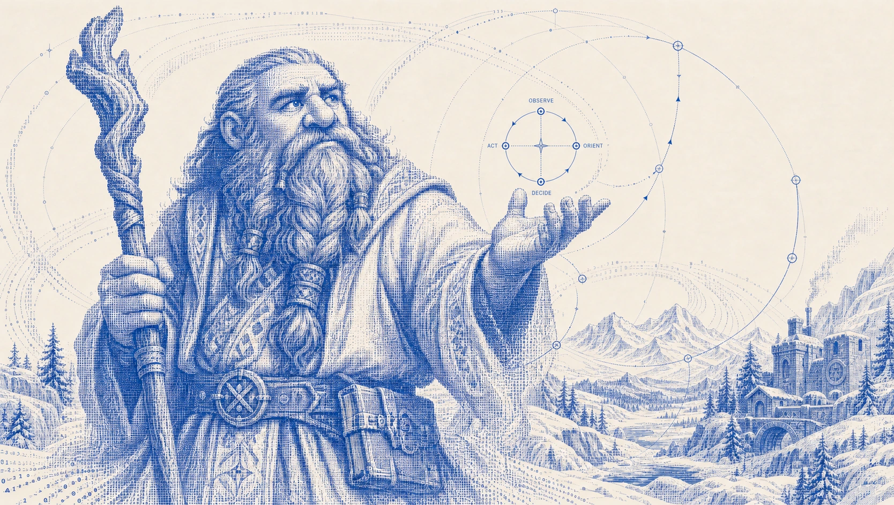
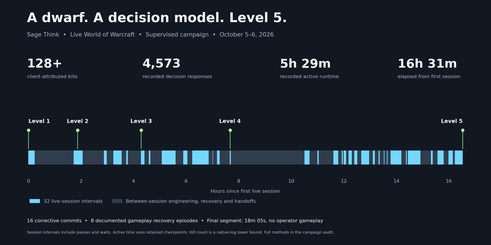
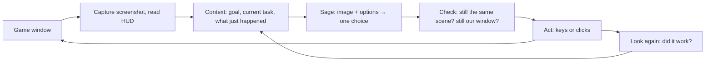

<div align="center">



# SageCraft

**An open-source harness that lets [Sage](https://levanto.ai), Levanto's decision model, play World of Warcraft from the screen.**

[How it works](#how-it-works) · [Try it offline](#try-it-offline) · [Live setup](docs/setup.md) · [Campaign report](docs/campaign.md) · [Contribute](CONTRIBUTING.md)

</div>

> [!IMPORTANT]
> **Research demonstration.** SageCraft is a free, open-source research demo of a decision model acting in a complex, changing environment. It is not a commercial product and is not sold. The harness is free; Sage calls need a Levanto API key and are billed at Levanto's standard rates.
>
> SageCraft is not affiliated with, endorsed or sponsored by Blizzard Entertainment. World of Warcraft and Blizzard are trademarks of Blizzard Entertainment, Inc.
>
> SageCraft works only from screenshots of the game window and ordinary keyboard and mouse input, like a person at the keyboard. It does not read or modify game memory, inject code, alter game files or get around any anti-cheat or security measure.
>
> Automated play may violate the game's terms of use and can lead to account suspension. Use it at your own risk, only on accounts you are prepared to lose. Provided as is, without warranty; see [LICENSE](LICENSE).

## What it did

A dwarf priest went from **level 1 to level 5** in a live World of Warcraft client, with Sage making the gameplay decisions from screenshots.



| | |
|---|---|
| **Level 1 → 5** | Same character, confirmed by two fresh readings of the level badge |
| **4,573 Sage decisions** | Every one answered by `levanto-sage-v1.3`; median response 0.8 s |
| **128+ kills** | Counted from the game's own combat log |
| **5h 29m of active play** | Across 32 sessions over 16½ hours |

It was a supervised campaign, not one uninterrupted run. Between sessions we fixed the harness 16 times, chose the hunting area once, and recovered the character 8 times (e.g. resurrections) with the runner stopped. The final session, from late level 4 to level 5, ran for 18 minutes with no human input. The [campaign report](docs/campaign.md) has the full account.

## How it works

**Sage makes the judgments; the harness gives it eyes, hands and memory.** Each step, the harness captures the game window and builds a short list of possible actions for the current situation. Sage gets the screenshot, some context and that list, and picks one (or says it can't tell). The harness checks the choice is still valid, sends the keys or clicks, and looks again.



| Sage decides | The harness does |
|---|---|
| Which action to take: attack, change target, move, heal, change destination, recover | Captures the screen; reads names, coordinates and health/mana bars with OCR and pixel checks |
| What it sees: own level, whether a target is selected, alive, its level and kind | Builds each menu of options, enforces level limits and retry budgets |
| Whether an action worked, and where to click to loot | Sends input safely: exact window, focus checks, stop on anything unexpected |
| When to give up on an area and try another | Runs fixed routines Sage authorises: a 3-cast burst, one opening cast after Sage targets an enemy, a second Escape to clear |

When Sage's answer is missing, late or not on the list, the harness does nothing and asks again. It never substitutes its own choice. When a local loop stops making progress (a route that goes nowhere, casts that miss), the harness escalates to a broader question, from action to encounter to hunting area.

### One real decision

From the final session, 15:17:21 UTC. Sage got the screenshot and these six options:

| Option | Meaning (shortened) |
|---|---|
| **`attack_mob_level_1`** ✓ | A living, eligible level-1 enemy is selected and in range: cast a guarded burst of 3 Smites |
| `reject_selected_target` | The selected unit is dead, friendly, a player or out of the allowed levels: clear it |
| `change_search_strategy` | This engagement isn't working: look elsewhere |
| `ui_blocked` | A chat box or menu is blocking input |
| `recover_now` | Emergency: death, low health or an unexpected threat |
| `cannot_assess` | Not enough evidence; do nothing |

It chose `attack_mob_level_1` in 0.9 s. About 35 seconds later Sage read its own level badge as 5, twice, and the run stopped. The [full excerpt](examples/final-run-excerpt.jsonl) has the surrounding decisions, including two-option ones.

### Loops at different scales


The design borrows John Boyd's **Observe–Orient–Decide–Act** loop and nests it: a single cast, an encounter, a route, a hunting area. When an inner loop stalls, the next one up gets the question. [Background on Boyd's OODA loop](https://www.airuniversity.af.edu/News/Display/Article/420819/ooda-loop-makes-its-mark-on-maxwell/).

<br clear="right">

## Requirements

- **Offline (replay and tests):** Python 3.12–3.14 and [uv](https://docs.astral.sh/uv/getting-started/installation/). Any OS.
- **Live play:** macOS only, an English World of Warcraft client and account, a [Sage API key](https://levanto.ai), and Screen Recording and Accessibility permissions. A run uses roughly 800–900 Sage decisions per hour of active play.

## Try it offline

No game, no API key, no input sent to your computer:

```sh
git clone https://github.com/levantolabs/sagecraft.git
cd sagecraft
uv sync --extra dev
uv run sage-wow --data-dir data/demo replay examples/final-run-excerpt.jsonl
```

This loads real events from the final session (options offered, Sage's choices, input receipts and the level-5 confirmation) into a local SQLite database and prints a summary.

Run the tests with `uv run pytest`. They never touch the game, the network or your keyboard.

## Play live

Live setup takes some work: calibrating screen regions, checking keybindings and choosing a hunting area. Follow **[docs/setup.md](docs/setup.md)**. The short version, once a profile is ready:

```sh
uv sync --extra macos --extra dev
uv run sage-wow --profile data/my-profile.yaml doctor   # checks permissions and the game window
uv run sage-wow --profile data/my-profile.yaml run      # starts a run
uv run sage-wow stop                                    # or Ctrl+Alt+Escape
```

## Learn more

| | |
|---|---|
| [Architecture](ARCHITECTURE.md) | Modules, the decision cycle and the safety checks around input |
| [Live setup](docs/setup.md) | Profile, calibration, bindings, launch and stop |
| [Campaign report](docs/campaign.md) | What happened in the level-five campaign, including what went wrong |
| [Contributing](CONTRIBUTING.md) | Development setup and good first contributions |

Known limits: macOS only, OCR and vision can be wrong, some recovery loops still stall, and the character can't resurrect itself. The campaign shows this setup working in one zone with one class; it isn't a general benchmark.

## License

[Apache 2.0](LICENSE). Boyd portrait: U.S. government photograph, public domain, via [Wikimedia Commons](https://commons.wikimedia.org/wiki/File:JohnBoyd_Pilot.jpg).
